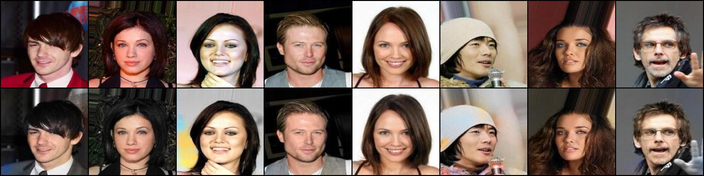

# Image colorization with Deep Learning
Project for the [Advanced Machine Learning](https://sites.google.com/di.uniroma1.it/aml-20-21) course, Sapienza University.

The aim of this project is to build a Pytorch model able to colorize black and white images. It is mainly based on the paper [Colorful Image Colorization](https://arxiv.org/abs/1603.08511), by Zhang et al., altough there are few minor adjustements and there is the possibility to train the model with different loss functions and parameters from the ones descripted in the paper.

## Usage
### Dependencies
In the repository, it is included `requirements.txt`, which consists in a file containing the list of items to be installed using conda, like so:

`conda install --file requirements.txt`

Once the requirements are installed, you shouldn't have any problem when executing the scripts. Consider also creating a new environment, so that you don't have to worry about what is really needed and what not after you're done with this project. With conda, that's easily done with the following command:

`conda create --name <env> --file requirements.txt`

where you have to replace `<env>` with the name you want to give to the new environment.

Notice that, unfortunately, this kind of requirements file is built on a Linux machine, and therefore it is not guaranteed that this will work on a different OS.
### Data structure
To train the model from scratch, it is mandatory to have a data directory in which the files are organized as follows:
```
├── train
│   ├── 1.jpg
│   ├── 2.jpg
│   └── 3.jpg
├── val
│   ├── 4.jpg
│   ├── 5.jpg
│   └── 6.jpg
└── test
    ├── 7.jpg
    ├── 8.jpg
    └── 9.jpg
```
### Training
Once you have the files well organized, you can start the training directly from command line, as shown in the following example (where just a few parser flags are used):

```shell
$ python3 main.py --batch_size 8 --data_dir data
```
## Results
There are several options when one wants to assess the quality of the trained network. The best possible option is to actually look at the images produced by the model itself. In fact, colorizing images can be seen as a multimodal problem, meaning that, for a single black and white image, there are multiple plausible colorizations. For this particular reason, human intervention during test time is probably the best option to discern bad models from good ones.

In our particular case, we trained our model on a small subset (4800/1200/1200 split for train/val/test) of the [CelebA dataset](http://mmlab.ie.cuhk.edu.hk/projects/CelebA.html), using the cropped and aligned version of the images.

The image below shows the behaviour of the model trained for 71 epochs on a set of 8 images taken from the test set, that the model didn't see neither during training or validation time. First row is composed by the 8 ground truth images, second row is composed by the 8 images produced by the model.

<p align="center">
  
</p>

## Repo structure
The repository consists of the following files:

**Scripts**:
* __`main.py`__:
    > Main script used to start the training and/or evaluation of the model. Run `python3 main.py -h` to show the complete list of flags.
* __`model.py`__:
    > Script containing the model class; the impleemntation is based on the one proposed on the paper by Zhang et al.
* __`fit.py`__:
    > Script containing the training and validation functions.
* __`data_loader.py`__:
    > Script containing the class for the custom dataset used in the training phase.
* __`utils.py`__:
    > Several functions used both during the training/validation phase and for the visualization GUI.
* __`visualization.py`__:
    > Script containing the implementation for the Python GUI to visualize a demo of a pre-trained model. Specify a `.pth` file as model and select a directory that contains jpg images to colorize black and white versions of the images contained in the directory and to compare them with the ground truth.

**Notebooks**:
* __`loss_visualizer.ipynb`__:
    > Notebook used to visualize the training and validation loss for a pre-trained model.

**Other**:
* __`objects`__:
    > Directory containing pickle objects used during training.
* __`requirements.txt`__:
    > A txt file containing the dependecies of the project; see the usage part for details.